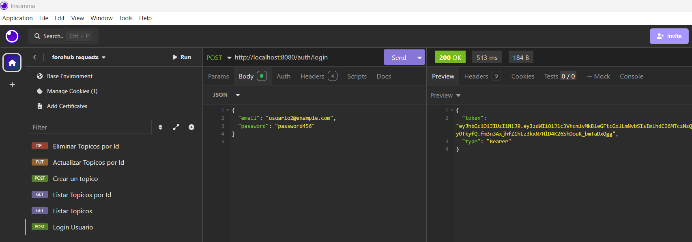
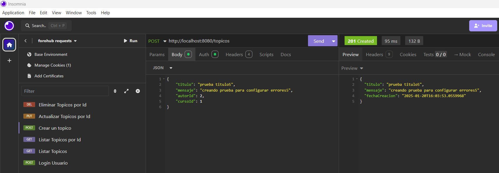
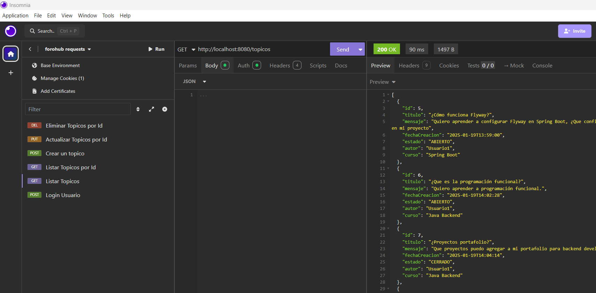
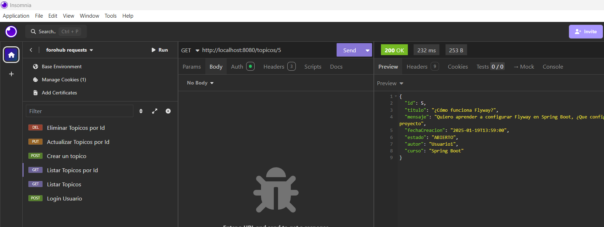
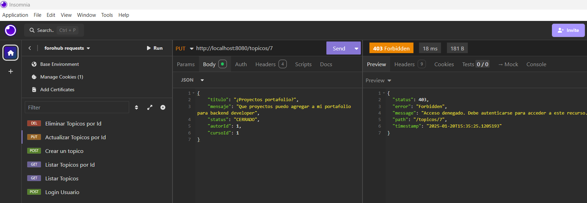
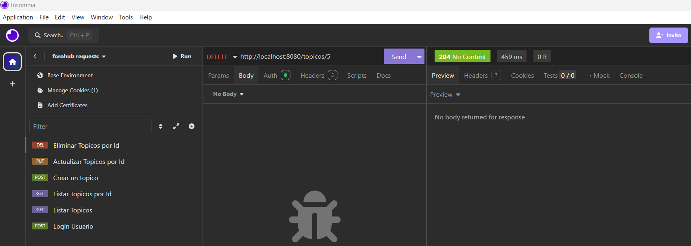

**Forohub** - API REST para Gestión de Foros
---
### **Desafío del curso de programación backend con Java de Alura y Oracle**

Forohub es una API REST diseñada para facilitar la gestión de foros de discusión. Permite a los usuarios autenticarse, crear, listar, actualizar y eliminar tópicos, asegurando que solo usuarios autorizados puedan interactuar con los recursos disponibles.  
Este proyecto destaca por implementar seguridad con JWT, un manejo eficiente de excepciones, y pruebas exhaustivas mediante herramientas modernas como Insomnia.

---

### **📋 Objetivos**

- Desarrollar una API REST funcional que cumpla con los estándares modernos de desarrollo.
- Implementar un sistema robusto de autenticación y autorización basado en JWT.
- Gestionar excepciones de manera centralizada y profesional.
- Aplicar conceptos avanzados de arquitectura de software para mantener el proyecto modular y escalable.

---

### **⚙️ Características**

1. **CRUD de Tópicos**:  
   Los usuarios pueden realizar operaciones de creación, lectura, actualización y eliminación de tópicos.

2. **Seguridad con JWT**:  
   Los recursos de la API están protegidos mediante un sistema de autenticación y autorización basado en tokens.

3. **Validaciones de Entrada**:  
   Implementación de validaciones mediante anotaciones de Spring para garantizar la integridad de los datos enviados por los usuarios.

4. **Manejo de Excepciones**:  
   Sistema centralizado para lanzar y manejar errores, proporcionando respuestas claras y consistentes.

---

### **🛠️ Tecnologías Utilizadas**


---

### **📚 Conocimientos Desarrollados**

- **Diseño de API RESTful**: Creación de endpoints siguiendo buenas prácticas y estándares HTTP.
- **Autenticación y autorización con JWT**: Gestión de usuarios y control de acceso seguro.
- **Persistencia de datos**: Uso de JPA/Hibernate para interactuar con la base de datos MySQL.
- **Pruebas de API**: Verificación de endpoints utilizando Insomnia.
- **Gestión de dependencias**: Configuración de Maven para integrar librerías necesarias.

---

### **📂 Estructura del Proyecto**

```plaintext
Forohub/
│
├── src/
│   ├── main/
│   │   ├── java/
│   │   │   ├── com.nestoraluraoracleone.forohub/
│   │   │   │   ├── controller/
│   │   │   │   ├── dto/
│   │   │   │   ├── model/
│   │   │   │   ├── repository/
│   │   │   │   ├── service/
│   │   │   │   └── config/
│   │   ├── resources/
│   │       ├── application.properties
│   │       └── db/migration/
│   └── test/
├── img/
│   ├── banner.png
│   ├── registro_topico.png
│   ├── autenticacion_jwt.png
│   ├── listado_topicos.png
├── pom.xml
└── README.md
```
### 📸  Capturas de Insomnia
1. Login

####
2. Crear Tópico

####
3. Listado de tópicos

####
4. Listado de tópicos por id

####
5. Actualizar tópico por id

####
6. Eliminar tópico por id

####


### Instalación y Ejecución 🚀

 1. Clonar el Repositorio

```sh
git clone https://github.com/nestorsauceda/forohub.git
cd forohub
```
2. Configura la base de datos en el archivo application.properties.
3. Ejecuta las migraciones de Flyway.
4. Ejecuta la aplicación:
```shields
mvn spring-boot:run
```

Este proyecto está licenciado bajo la Licencia MIT. Consulta el archivo LICENSE para más detalles.
### Autor

Desarrollado por Nestor Sauceda.

**Contacto:**

* GitHub: https://github.com/nestorsauceda

* Email: nasp41@gmail.com

##

¡Gracias por revisar este proyecto! 😊
por explorar este proyecto. Espero que pueda servir como inspiración o referencia para tus propias implementaciones. Si tienes alguna pregunta o sugerencia, no dudes en contactarme.